# pepperApplications

This Git repos contains all the applications installed on Pepper and used by IMERIR during various events (trade fairs, open days, etc.) in which he participates...

## Contents

1. [Introduction](#introduction)
2. [Presentation of this repos](#presentation_of_this_repos)
3. [What is this repos' structure ?](#what_is_this_repos_structure)
4. [What are this repos' components ?](#what_are_this_repos_components)
5. [How to install an application (danse, demonstration or other) on the robot ?](#how_to_install_an_application_on_the_robot)
6. [How to install a language on the robot ?](#how_to_install_a_language_on_the_robot)
7. [How to install a dialog box on the robot ?](#how_to_install_a_dialog_box_on_the_robot)
8. [How to clone this repos ?](#how_to_clone_this_repos)
9. [Useful links](#useful_links)
10. [Conclusion](#conclusion)

## Introduction

IMERIR is an engineering school providing training in IT, connected objects, artificial intelligence, maker culture and robotics. By the way, here is its logo:

This school has a humanoid robot known as Pepper. Initially manufactured and marketed by the French company Aldebaran robotics, the production and marketing of Pepper was taken over by the Japanese company Softbank when the latter acquired Aldebaran robotics. Here is an image of this robot so emblematic of humanoid robotics:

IMERIR uses the Pepper robot as the school mascot during various trade shows, meetings and professional forums focused on computer technologies and robotics as well as geek culture. 
As shown in some photos below, the Pepper robot from IMERIR is emulated wherever it goes.

## Presentation of this repos

This repos contains all applications which may be installed on the IMERIR's Pepper robot. This applications are used by the school, in different events like trade shows, open houses, conferences and more. As the mascot and ambassador of IMERIR, the robot can dance, make all kinds of demonstrations, as well as react to different words, to different emotions and gestures.

__All of this apps are availables on the robot tablet's when they are installed on Pepper (customized app-launcher for IMERIR, available here: https://github.com/Vicken-Ghoubiguian/app-launcher)__

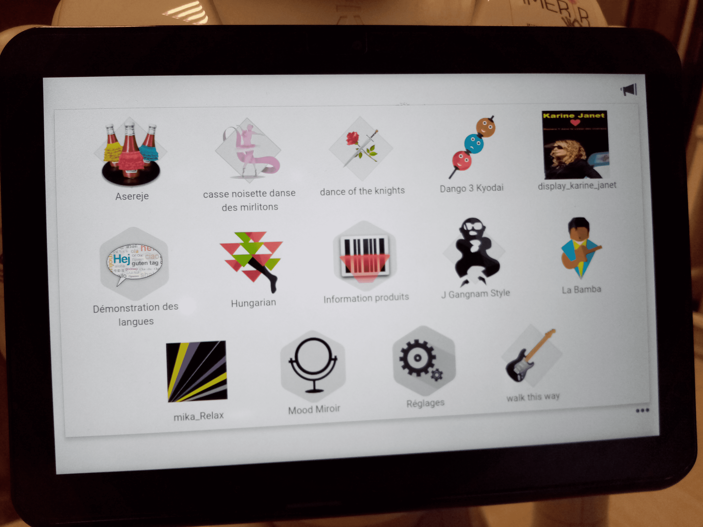

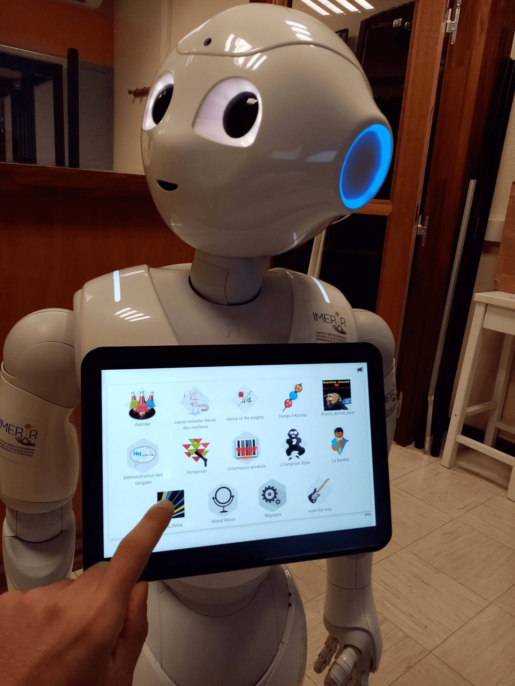

Now is the time to get to the heart of the matter...

## What is this repos' structure ?

This repos is composed of many elements which will be presented here:

* **danses:** this directory contains all danses to be installed on the IMERIR Pepper robot (all details are available in directory's README.md file);

* **demonstrations:** this directory contains all demonstration applications to be installed on the IMERIR Pepper robot (all details are available in directory's README.md file);

* **dialogs:** this directory contains all dialog boxes to be installed on the IMERIR Pepper robot (all details are available in directory's README.md file);

* **languages:** this directory contains all languages to be installed on the IMERIR Pepper robot (all details are available in directory's README.md file);

* **images_to_display_in_github_repos:** this directory contains all images to display in this git repos;

* **.gitattributes:** This file contains one instruction to do Git LFS (Git Large File Storage) get in charge of the defined files;

* **README.md:** this file exposes all the overview and general documentation of this git repository.

Now it's done. Simple ! No 🐱 ?

## What are this repos' components ?

The repos' structure is explained [above](#what_is_this_repos_structure). We saw that all applications to be installed on Pepper are distributed into 4 directories which are __danses__ (for danses applications), __demonstrations__ (for many demonstrations to make do the robot), __dialogs__ (for dialog boxes to be installed on the robot) and __languages__ (for languages to be installed on Pepper). Each have their own 'README.md' file, to list and to explain all applications contained in the directory itself. So here we go...

## How to install an application (danse, demonstration or other) on the robot ?

In this section, we will show you how to install an app on the Pepper robot of IMERIR. The process is illustrated by the installation of the gangnam style dance application on the Pepper robot. So let's go...

1. Please turn on the Pepper robot first;

2. then wait for the robot to pronounce “Ognak Gnuk” and check its environment, this means that the robot is now on;

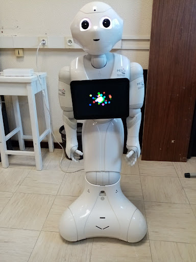

3. please connect the Pepper robot to the Choregraphe software now. You have to open the software in question to do this.

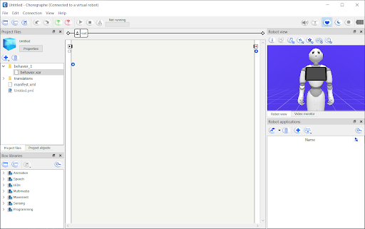

Then click on the button  indicated on the screenshot below.

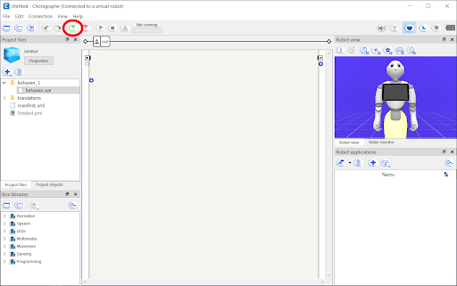

The window shown in the screenshot below then opens.

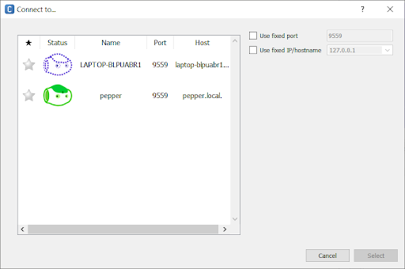

So please select the robot colored in green (or the one you want which is also colored in green) and then press the “Select” button as shown below.

Let's go back to the interface shown above. In the table on the left, you must choose the robot you want to connect to Choregraphe. In the “status” column, there are several robots, each represented by a head of Nao robots. The dotted robot (opposite ) corresponds to the virtual robot, a simulation of the Pepper robot installed by default with Chorégraphe and which is just as interfaceable, controllable and programmable as a physical robot. A real physical Pepper robot is full line and:

* either it is colored green with the eyes open (opposite ): you can connect to this robot because its NAOqi OS is running,

* or it is colored red with closed eyes (opposite ): you cannot connect to this robot because its NAOqi OS is stopped.

4. Now is the time to install the application on the Pepper robot. To do this, open the application you want in the Choregraphe software. To illustrate the procedure, the “display Karine Janet” application available in the current GitHub project, in the “demonstrations” folder, will be taken as an example. 

This app simply displays the following image on the Pepper robot's digital tablet.

This is a basic application but it perfectly illustrates the process of installing an application on the Pepper robot.

Now please clone the current project wherever you want on your development machine with the following command:

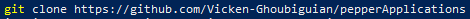

In this example and for illustration purposes, this project will be cloned to the computer's desktop.

Now open this application in the Choregraphe software. For this, the entire procedure is illustrated in the screenshots below.

5. Now that the application in question is open in Chorégraphe, it's time to install it on the Pepper robot. To do this, please click on the button . This button has 2 options:

    1. “Package and install current project to the robot”: packages and installs the open application in the Choregraphe software on the Pepper robot,

    2. “Install a package to the robot ...”: installs a packaged application on the Pepper robot.

The first option is the default option for this button. So each time you click on it, the Choregraphe software packages the open application and then installs it on the Pepper robot.

Its position in the Choregraphe software interface is illustrated by the screenshot below.

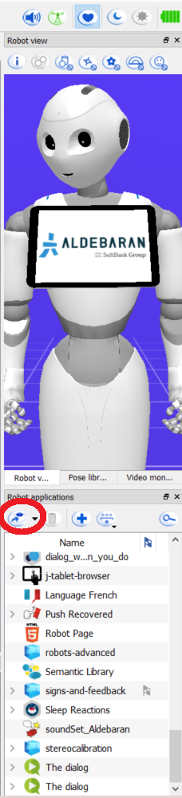

Once you have pressed the button  therefore, the following window is displayed and indicates the percentage of the transfer of the application to be installed (“display_Karine_Janet” in our example) from your machine to the robot in percentage (%).

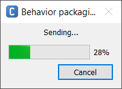

Once at 100%, the following window appears showing that the application is installed on the Pepper robot.

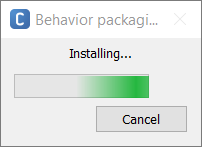

Once this window disappears, the installation of the application is complete.

6. Congratulations, the application you wanted to install (“display_Karine_Janet” in our example) is finally. You can see this by checking in the right menu of the Choregraphe software as shown in the screenshot below.

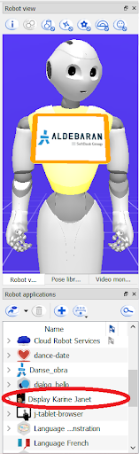

You can also check it on the Pepper robot's digital tablet. The app icon and title should be displayed below the first above the second as shown in the following screenshot.

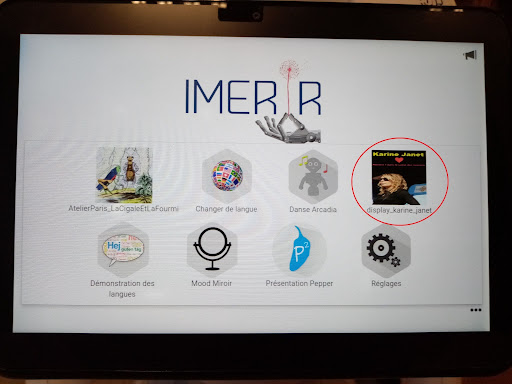

You can also open (have it run) on the Pepper robot by clicking on it.

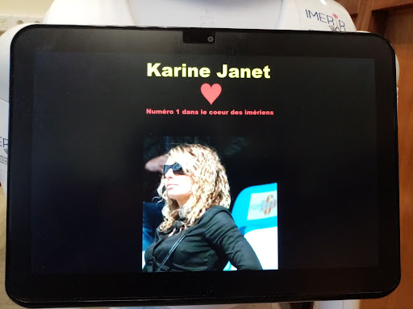

And here is the (good) job...

Just a piece of cake 🐱. No ?

## How to install a language on the robot ?

To install a language on the robot is exactly the same thing that to install any Pepper applications. For more informations, you can check the corresponding section [just here](#how_to_install_an_application_on_the_robot). However, we will show the language installation process on Pepper by taking the french language example. So let's go...

To install an additional language on the Pepper robot, you must follow the following instructions:

1. please turn on the Pepper robot first;

2. then please wait for the robot to pronounce “Ognak Gnuk” and check its environment, this means that the robot is now on;

Please now proceed to the next step.

3. please connect the Pepper robot to the Choregraphe software now. To do this, you must open the Choregraphe software;

Then click on the button  indicated on the screenshot below.

The window shown in the screenshot below then opens.

So please select the robot colored in green (or the one you want which is also colored in green) and then press the “Select” button as shown below.

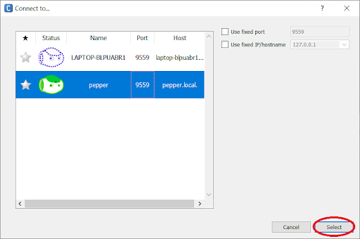

Let's go back to the interface shown above. In the table on the left, you must choose the robot you want to connect to Choregraphe. In the “status” column, there are several robots, each represented by a head of Nao robots. The dotted robot (opposite ) corresponds to the virtual robot, a simulation of the Pepper robot installed by default with Chorégraphe and which is just as interfaceable, controllable and programmable as a physical robot. A real physical Pepper robot is full line and:

* either it is colored green with the eyes open (opposite ): you can connect to this robot because its NAOqi OS is running,

* or it is colored red with closed eyes (opposite ): you cannot connect to this robot because its NAOqi OS is stopped.

4. 

5. Now is the time to install the language(s) you want on the Pepper robot. To do this, nothing could be simpler because it(they) can be installed or reinstalled like any Choreographer application on the Pepper robot. In the context of this tutorial, a reinstallation will be carried out. So do “File”> “Import project from former project directory…” as shown in the screenshot below.

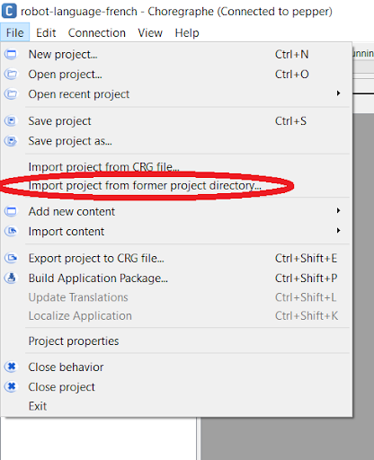

The following interface will then appear.

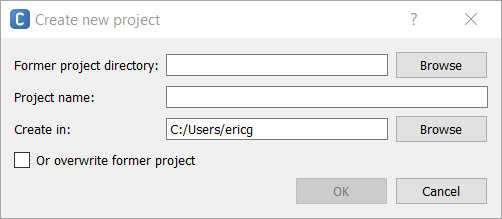

Now click on the “OK” button, then the interface below will appear.

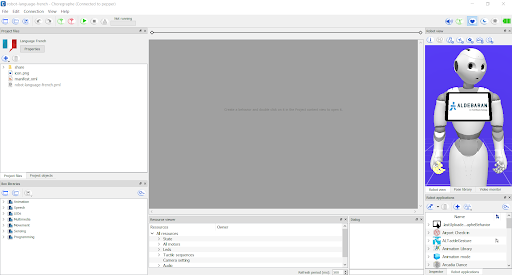

The peculiarity of applications like this is that there is no “behavior” or “.xar” file (named after the corresponding file extension), i.e. the type of file that can be executed in the Chorégraphe software.

You must now install the “robot-language-french” application on the Pepper robot. To do this please click on the button , which is also shown in the following screenshot.

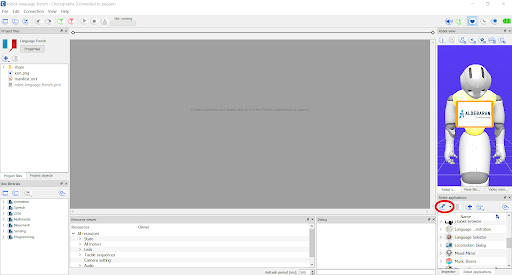

The following window is then displayed and indicates the percentage of the transfer of the "robot-language-french" application from your machine to the robot in percentage (%).

Once at 100%, the following window appears showing that the application is installed on the Pepper robot.

Once this window disappears, the installation of the application is complete.
The “robot-language-french” application under the name of “Language French” then appears in the applications menu of the Pepper robot as illustrated by the screenshot below...

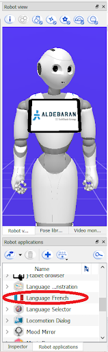

So all my congratulations: the “robot-language-french” application has been successfully installed on the robot and the French language is now available on the robot.

6. By accessing the parameters of the Pepper robot (here online), you can finally choose French as the language.

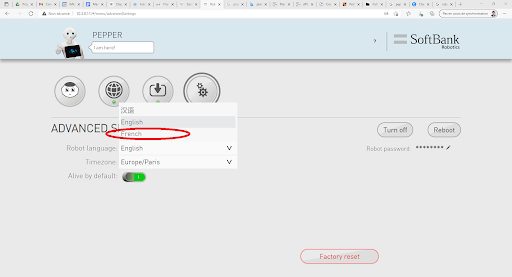

__Warning:__ if French does not appear in the language selection menu, then refresh the page. French should appear right after.

As you can see, the parameters of the Pepper robot indicate that its language is French as shown in the screenshot below.

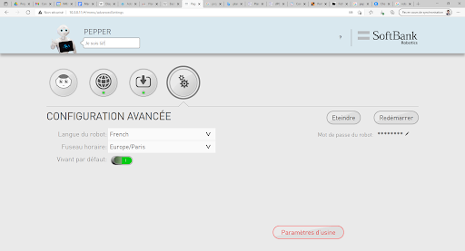

Just a piece of cake 🐱. No ?

## How to install a dialog box on the robot ?

To install a dialog box on the robot, things get a little tough. To make a dialog box work, you must first of all install a particular application on Pepper. But don't panic. Everything will be explained in this section. We will now explain what is this particular and mentioned application to install on Pepper to make dialog boxes work, and how to install it. So let's go...

It is now time to see how to install a dialog box on Pepper. And now, things became much easier. So go...

Just a piece of cake 🐱. No ?

## How to clone this repos ?

## Useful links

* 
* 
*  
* [Daniel Schofield's YouTube playlists to learn Chorégraphe - YouTube](https://www.youtube.com/channel/UC4hZnfn8PiB-mNf7lXhJFaA/playlists);
* [NAOqi Documentation Center (from the version 1.14 to the 2.8) - SoftBank Robotics](http://doc.aldebaran.com/index.html);
* [Link to download Chorégraphe - Softbank robotics](https://www.softbankrobotics.com/emea/en/support/pepper-naoqi-2-9/downloads-softwares);
* [Manuel pour une prise en main rapide et efficiente du robot Pepper (written in french)](https://docs.google.com/document/d/1ZAIgvsyCzpJZ3wD4W-0Gt4teEFrPybbgo8e2c1v9GA4),
* [Git Large File Storage](https://git-lfs.github.com/),
* [Configuring Git Large File Storage - GitHub](https://docs.github.com/en/repositories/working-with-files/managing-large-files/configuring-git-large-file-storage),
* [Git LFS - Atlassian](https://www.atlassian.com/git/tutorials/git-lfs),
* [Windows git "warning: LF will be replaced by CRLF", is that warning tail backward ? - Stack overflow](https://stackoverflow.com/questions/17628305/windows-git-warning-lf-will-be-replaced-by-crlf-is-that-warning-tail-backwar/38112001),
* [What is the best git config set up when you are using Linux and Windows ? - Stack overflow](https://stackoverflow.com/questions/6081607/what-is-the-best-git-config-set-up-when-you-are-using-linux-and-windows/6081812#6081812),
* [Customizing Git - Git Configuration](https://www.git-scm.com/book/en/v2/Customizing-Git-Git-Configuration),
* 
* 
* 

## Conclusion

Despite the simplicity of this project, writing its documentation was complicated.
